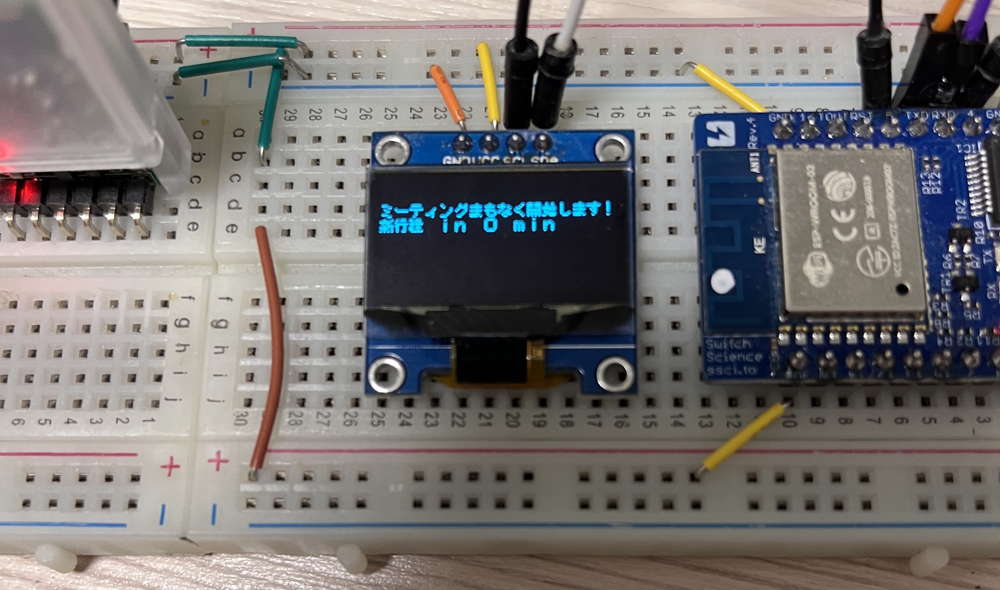

## Summary

This small SwiftUI project integrates [EventStore](https://developer.apple.com/documentation/eventkit/ekeventstore) and CoreBluetooth to send notification to your IoT device. In this case I'm using oLED to display next event and adding a buzzer to notify me.

You can integrate with your own device by modifying the UUID in BLEManager.swift

## Demo

Please notice that you have to write code to handle BLE connection and receiving the message.
